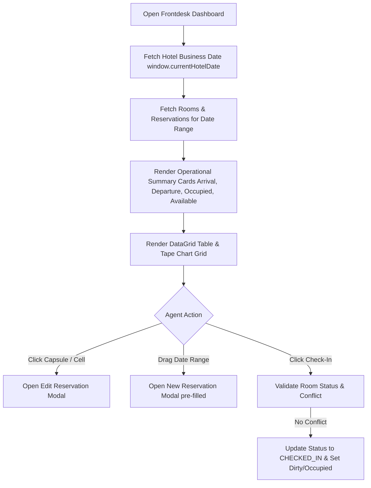
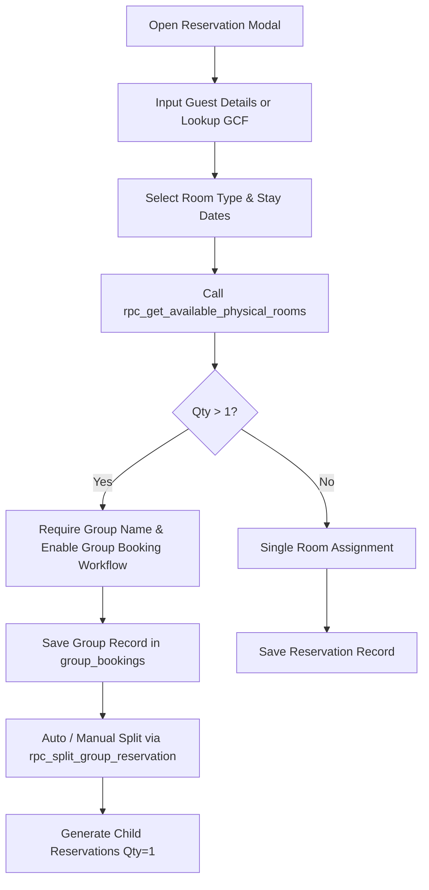
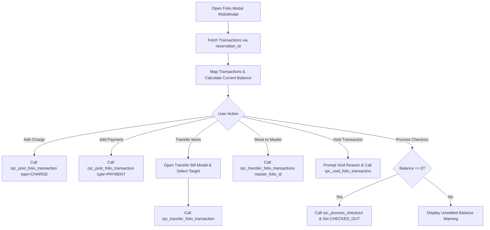
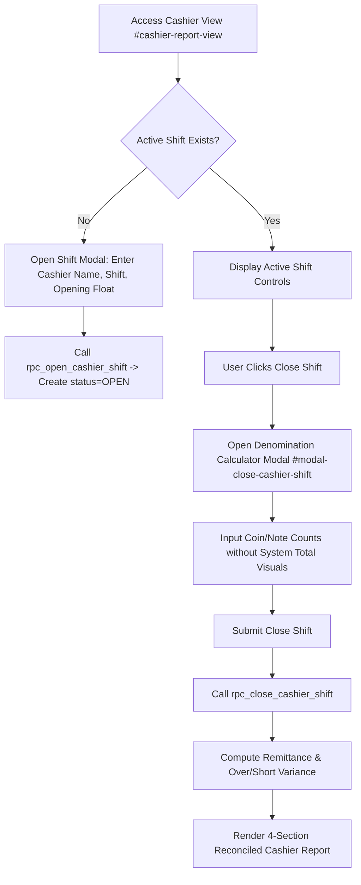
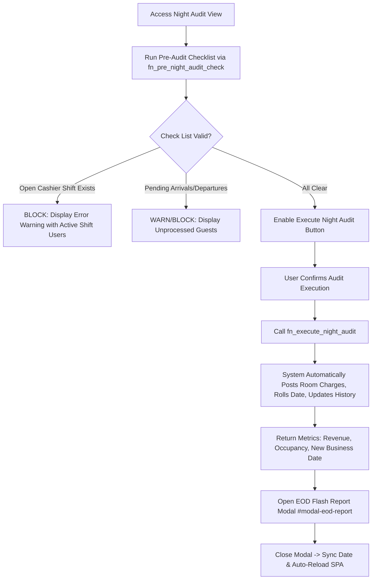

# Product Requirement Document (PRD) - Hotel Property Management System (PMS)

## Executive Summary

The Hotel Property Management System (PMS) is a comprehensive, web-based single-page application (SPA) designed to automate and streamline frontdesk operations, guest reservation lifecycles, billing and folio accounting, group booking split management, housekeeping tracking, cashier shift balancing, and daily night audit settlement. Powered by an ES6 modular architecture on the client side and Supabase (PostgreSQL with PostgREST APIs and Stored Procedures) on the backend, the system maintains strict real-time auditability across multi-room B2C reservations and B2B corporate master accounts, anchoring operational dates to a synchronized hotel business date.

---

## Glossary of Terms

| Term | Definition |
|---|---|
| **Allotment** | Pre-allocated block of rooms reserved for a specific travel agent, corporate client, or group, typically under a contract rate. |
| **B2B (Business-to-Business)** | Corporate or travel agent accounts billed via Master Folio rather than individual guest folios. |
| **B2C (Business-to-Consumer)** | Individual guest reservations billed directly to personal folios. |
| **Blind Drop** | Cashier shift close procedure where the cashier counts physical cash without seeing the system-expected total, preventing disclosure bias. |
| **Business Date** | The operational date used by the hotel system (stored in `system_settings.current_hotel_date`), which may differ from the calendar date until Night Audit rollover. |
| **City Ledger / AR (Accounts Receivable)** | Outstanding invoices for corporate guests or groups billed to Master Folios, collected after checkout. |
| **EOD (End of Day)** | Night Audit settlement process that posts daily charges, advances business date, and generates financial reports. |
| **FIT (Free Independent Traveler)** | Individual guest not part of a group booking; pays standard rack rate or contracted individual rate. |
| **Folio** | Financial ledger for a guest stay, recording all charges, payments, and transfers. |
| **GCF (Guest Card File)** | Master database of guest profiles containing identity, contact, and stay history information. |
| **Master Folio** | Consolidated billing account for B2B groups or corporate clients, aggregating charges from multiple guest folios. |
| **NSG (Non-Stay Guest)** | Walk-in or external customer using hotel services (restaurant, laundry) without an active room reservation. |
| **Night Audit** | End-of-day reconciliation process that verifies transactions, posts room charges, and advances the business date. |
| **Opening Float** | Initial cash amount declared in the cashier drawer at the start of a shift. |
| **Over/Short** | Variance between declared physical cash and system-expected cash during cashier shift close. Positive = surplus; negative = shortage. |
| **Paymaster Room / Virtual Room** | Non-physical room used for Master Folio billing aggregation; excluded from occupancy metrics and housekeeping tasks. |
| **RC (Registration Card)** | Printed document signed by guest at check-in containing stay details, rate, and identity confirmation. |
| **Remittance** | Cash amount dropped for bank deposit after deducting petty cash retained for next shift float. |
| **Rooming List** | Detailed list of guests within a group booking, showing names, room assignments, and stay dates. |
| **Tape Chart** | Visual timeline grid displaying room reservations across dates, used for quick availability overview and drag-to-book operations. |
| **Void** | Cancellation of a posted transaction that retains the original record (soft delete) with mandatory audit trail (reason, user, timestamp). |

---

## User Roles & Permissions

The application uses local storage session defaults (`localStorage.getItem('cashierName')` or `window.currentUser.name`) with client-side context resolution to govern system actions. Roles are structured into three operational levels:

### 1. Front Desk Agent / Cashier
- **Scope**: Day-to-day front office operations and immediate guest transactions.
- **Permitted Actions**:
  - View Frontdesk Dashboard, Tape Chart, and Room Forecast.
  - Create, edit, and search individual guest reservations, including guest identity document compression and webcam capture.
  - Open and close individual Cashier Shifts (`rpc_open_cashier_shift`, `rpc_close_cashier_shift`) with blind cash drop input.
  - Post folio charges and payments (`rpc_post_folio_transaction`) to personal folios.
  - Execute Bill Transfers (`rpc_transfer_folio_transaction`) between guest folios.
  - Process guest check-ins and check-outs (`rpc_process_checkout`).
  - Update housekeeping status (Clean, Dirty, Inspected, Out of Order).
- **Restrictions**:
  - Cannot execute Night Audit process.
  - Cannot override rate structures or delete master settings without admin authorization.

### 2. Night Auditor / Finance Officer
- **Scope**: Operational reconciliation, EOD settlement, and financial oversight.
- **Permitted Actions**:
  - All Cashier and Front Desk functions.
  - Perform Pre-Audit validation checks (`fn_pre_night_audit_check`).
  - Execute EOD Night Audit (`fn_execute_night_audit`) to advance system hotel business date (`current_hotel_date`).
  - Generate and print EOD Flash Reports and Cashier Reconciliation Summaries (`fetchEodCashierReconciliation`).
  - Review historical night audit history (`night_audit_history`).
  - Handle deposit settlements and refund processing for canceled reservations.

### 3. System Administrator / Hotel Manager
- **Scope**: Full system configuration, master data governance, and corporate management.
- **Permitted Actions**:
  - All Night Auditor and Front Desk functions.
  - Manage Property Settings, Bed Types, Room Types, Physical Rooms, and Out of Order (OOO) room blocks.
  - Configure Tax & Service percentages, Meal Plans, Departments, Outlets, and Extra Charge catalogs.
  - Define Rate Plans, Seasonality Matrix, Market Segments, and Corporate B2B profiles (`corporate_profiles`).
  - Manage Guest Card Files (GCF) master records, merge duplicate profiles, and configure B2B Contract Rates.

---

## Core Functional Modules

### 1. Frontdesk Dashboard & Tape Chart

#### User Story
> **As a** Front Desk Agent,
> **I want to** view real-time room availability, arrival/departure counts, and a visual tape chart timeline,
> **So that** I can assign rooms quickly, check in guests, and prevent double-booking.

#### Key Workflows

- **Step 1**: Load business date via `getHotelBusinessDate()` (stored in `window.currentHotelDate`).
- **Step 2**: Query `reservations` joining `guest_card_files!fk_reservations_guest_card`, `room_types`, and `rooms` (`js/modules/frontdesk.js`).
- **Step 3**: Display DataGrid displaying Reservation No, Guest Name, Stay Dates, Room Type, Room Rate, Room No, and Action buttons.
- **Step 4**: Render 14-day interactive Tape Chart grid displaying physical room rows, status badges (Clean, Dirty, Inspected, OOO), and floating reservation capsules.
- **Step 5**: Enable drag-to-select on Tape Chart dates to initiate quick reservation creation for selected room and date range.

#### Edge Cases Handled
- **Virtual / Paymaster Rooms**: Filtered out (`is_virtual = false`) from physical occupancy metrics and Tape Chart room lists.
- **Unassigned Rooms**: Reservations without assigned `room_id` are displayed in a dedicated "Unassigned Reservations" drawer at the bottom of the Tape Chart for drag-and-drop or manual assignment.
- **Name Fallback Chain**: Resolves guest names via `res.guest_name || gCard?.full_name || `${gCard?.first_name || ''} ${gCard?.last_name || ''}`.trim() || res.booker_name || 'Guest'`.

---

### 2. Reservation & Group Split Management

#### User Story
> **As a** Reservation Clerk,
> **I want to** create individual or multi-room group reservations with identity uploads and split line controls,
> **So that** I can manage B2C guests or B2B group allocations efficiently.

#### Key Workflows

- **Step 1**: User inputs guest info (`res-guest-name`, `res-phone`, etc.) or searches GCF master via `#btn-lookup-guest`.
- **Step 2**: Select room type, check-in, check-out dates; `handleRoomTypeChange()` triggers `rpc_get_available_physical_rooms` to populate room choices.
- **Step 3**: If identity document is provided, client compresses image (JPEG quality 0.7, max width 800px via `getCompressedDocBlob`) or captures via webcam canvas, uploading to Supabase Storage bucket `guest_documents`.
- **Step 4**: If `Qty > 1`, `handleQtyChange()` toggles `#res-group-name` to required. Saving creates a master record in `group_bookings` and sets `group_id` on reservations.
- **Step 5**: Executing group split via `splitGroupReservation` calls `rpc_split_group_reservation` (with fallback) to split multi-qty parent reservation into $N$ individual child reservation records (`qty = 1`), setting `status = 'GUARANTEED'`.

#### Edge Cases Handled
- **Room Assignment Conflicts**: `checkRoomConflict()` validates physical room availability against active overlapping reservations before saving or checking in, preventing double bookings.
- **Foreign Key Sanitize**: `handleSaveReservation` converts empty strings, `0`, or `undefined` for `guest_card_id` and `guest_profile_id` strictly to `null` to prevent PostgREST foreign key errors.
- **Tentative vs Active Statuses**: Reservations with `TENTATIVE` status do not hold room inventory in availability counts, whereas `GUARANTEED`, `6PM_HOLD`, and `ORAL_CONFIRM` lock room stock.

---

### 3. Guest & Master Folio Accounting

#### User Story
> **As a** Front Desk Cashier,
> **I want to** post charges, log payments, transfer bill items, and settle accounts,
> **So that** guest balances are accurately maintained and audited prior to checkout.

#### Key Workflows

- **Step 1**: Open `#folioModal` for active reservation (`js/modules/folio.js`).
- **Step 2**: Fetch transactions filtering by `reservation_id` or `master_folio_id`.
- **Step 3**: Compute totals: `Balance = Total Charges - Total Payments`. Payments include `PAYMENT`, `DEPOSIT`, `CASH`, `CREDIT_CARD`, `BANK_TRANSFER`.
- **Step 4**: Posting charge or payment calls `rpc_post_folio_transaction`.
- **Step 5**: Bill Transfer allows transferring selected items (`.folio-tx-cb`) to another in-house room or NSG account using `rpc_transfer_folio_transaction` with reversal offset accounting entries.
- **Step 6**: Master Folio linking allows transferring personal charges to B2B Master Folios (`master_folios`), flagging personal items with a "Transferred to Master Folio" badge and excluding them from personal balance calculations.
- **Step 7**: Checkout requires zero balance; calling `rpc_process_checkout` updates reservation status to `'CHECKED_OUT'` and sets room status to `'Dirty'`.

#### Edge Cases Handled
- **Void Audit Trail**: Transactions cannot be hard-deleted. Voiding requires a mandatory reason, flags `is_void = true`, sets `voided_by` and `voided_at`, and excludes amounts from revenue while retaining items in audit history.
- **Transferred Items Reversal**: Reversal entries ensure target folios show incoming charges while source folios show offsetting credits.

---

### 4. Cashier Shift Management

#### User Story
> **As a** Hotel Cashier,
> **I want to** declare opening floats, perform blind drops during shift close, and reconcile payments,
> **So that** cash collections match system expectations without disclosure bias.

#### Key Workflows

- **Step 1**: Check active shift for current user and business date in `cashier_sessions`.
- **Step 2**: If no shift exists, prompt cashier for Name, Shift Name (Morning, Evening, Night), and Opening Float, calling `rpc_open_cashier_shift`.
- **Step 3**: To close shift, open Denomination Calculator (`#modal-close-cashier-shift`). Cashier enters physical breakdown (e.g., 100k, 50k bills) without system expected total displayed (Blind Drop protocol).
- **Step 4**: System executes `rpc_close_cashier_shift`, recording `declared_total_cash`, computing `remittance_amount` (`declared - petty_cash_retained`), and calculating `over_short` variance against `system_expected_cash`.
- **Step 5**: Render 4-Section Report:
  1. Cash Movement (Opening Float, Cash Payments, Paid Out, Net Cash).
  2. Non-Cash Payments (EDC Credit/Debit, Bank Transfers).
  3. City Ledger / AR Transfers.
  4. Voided Transactions.

#### Edge Cases Handled
- **Duplicate Close Prevention**: Submit button is disabled with loading indicators during execution to prevent multi-click double settlement.
- **Orphan / Unassigned Transactions**: Transactions posted without active `cashier_session_id` trigger warning banners in EOD and cashier reports.

---

### 5. Night Audit & EOD Settlement

#### User Story
> **As a** Night Auditor,
> **I want to** run pre-audit checks, rollover the hotel business date, and generate EOD flash reports,
> **So that** daily financial accounts are locked and system business date advances reliably.

#### Key Workflows

- **Step 1**: Navigate to `#night-audit-view` (`js/modules/night_audit.js`).
- **Step 2**: Execute Pre-Audit Validation calling `fn_pre_night_audit_check`, checking:
  - System hotel business date (`system_settings.current_hotel_date`).
  - Pending Arrivals (`status IN ('GUARANTEED', '6PM_HOLD')` with check-in = business date).
  - Pending Departures (`status = 'CHECKED_IN'` with check-out = business date).
  - Open Cashier Sessions (`cashier_sessions` with `status = 'OPEN'`).
- **Step 3**: If open cashier shifts exist, audit execution is strictly blocked with warning listing open shift cashiers.
- **Step 4**: Auditor clicks "Jalankan Night Audit" and confirms `#modal-night-audit-confirm`.
- **Step 5**: Invoke `fn_execute_night_audit(p_user_name)`, which:
  - Posts daily room charges for in-house guests.
  - Rollovers `current_hotel_date` to next calendar day.
  - Inserts summary metrics into `night_audit_history`.
- **Step 6**: Display EOD Flash Report modal (`#modal-eod-report`) with Cashier Reconciliation Summary aggregated via `fetchEodCashierReconciliation()`.
- **Step 7**: Closing EOD report updates `window.currentHotelDate` and reloads window to sync all UI modules.

#### Edge Cases Handled
- **Unclosed Cashier Shift Enforcement**: Audit cannot proceed if any cashier session remains in `'OPEN'` status on the business date.
- **Date Desynchronization Protection**: Day Change Detector in `js/app.js` runs a 60-second polling check comparing client date against system date, triggering reload if midnight transitions occur.

---

## Operational Constraints

1. **Business Date Sovereignty**: All operational transactions, daily revenue reports, and cashier reconciliations anchor to `current_hotel_date` from `system_settings` rather than client local machine time.
2. **Checkout Balance Requirement**: Guests cannot be checked out (`CHECKED_OUT`) if `currentBalance != 0`. Outstanding balances must be settled via payment or routed to Master/AR Folio.
3. **Room Inventory Allocation**: Room availability stock strictly deducts reservations in `GUARANTEED`, `6PM_HOLD`, `ORAL_CONFIRM`, `CHECKED_IN`, and `Checkin` statuses. Reservations with `TENTATIVE` status leave rooms marked as Available.
4. **Void Non-Destructibility**: Transaction deletion is forbidden. Voided transactions retain original IDs with `is_void = true`, mandatory `void_reason`, `voided_by`, and `voided_at` timestamps for forensic auditing.
5. **Master / Personal Folio Isolation**: Charges transferred from Personal Folio to Master Folio are marked with `master_folio_id` and excluded from personal folio total charges/balances.
6. **Physical Room Conflict Guard**: Physical room numbers cannot be assigned to overlapping reservations for identical date ranges; pre-save and pre-checkin functions (`checkRoomConflict`) block conflicting assignments.
7. **Cashier Session Binding**: Every folio transaction posted by an active cashier inherits `cashier_session_id` to ensure precise per-shift reconciliation and audit traceability.

---

## Non-Functional Requirements

### 1. Performance
- Dashboard Frontdesk harus load dalam waktu < 3 detik pada koneksi broadband standar (10 Mbps).
- Laporan EOD Flash Report dan Cashier Reconciliation harus ter-render dalam < 5 detik untuk database dengan hingga 100.000 transaksi.
- Query Night Audit pre-check harus selesai dalam < 2 detik.
- Tape Chart 14-hari dengan 50+ kamar fisik harus render tanpa lag visual yang signifikan.
- Image compression untuk dokumen tamu (ID card) harus selesai di client-side dalam < 1 detik (JPEG quality 0.7, max width 800px).

### 2. Scalability
- Sistem harus mendukung properti hotel dengan hingga 200 kamar fisik.
- Mendukung hingga 50 concurrent users (Front Desk, Housekeeping, Admin) tanpa degradasi performa yang signifikan.
- Database harus mampu menampung minimal 5 tahun riwayat transaksi operasional (estimasi ~500.000 baris folio_transactions) dengan query tetap responsif berkat indexing yang tepat.

### 3. Security
- Semua komunikasi client-server harus melalui HTTPS (dipastikan oleh Vercel/Supabase hosting).
- Supabase Row Level Security (RLS) harus aktif pada semua tabel yang mengandung data tamu dan transaksi finansial.
- Session timeout: User harus re-authenticate setelah 30 menit tidak ada aktivitas (idle).
- Password policy: Minimal 8 karakter dengan kombinasi huruf dan angka (dikelola oleh Supabase Auth).
- Secret management: Supabase URL dan Anon Key tidak boleh di-hardcode di repository public. Gunakan environment variables di Vercel.
- Void transactions memerlukan audit trail wajib (reason, user, timestamp) dan tidak boleh dihapus secara fisik (soft delete only).

### 4. Availability & Backup
- Target uptime: 99.5% selama jam operasional hotel (24/7).
- Database backup: Automated daily backup via Supabase dashboard dengan retensi minimal 7 hari.
- Recovery Point Objective (RPO): Maksimum 24 jam (data yang hilang saat disaster = 1 hari operasional).
- Recovery Time Objective (RTO): Maksimum 4 jam untuk restore penuh.

### 5. Browser Compatibility
- Google Chrome 90+ (Primary target, recommended).
- Mozilla Firefox 88+.
- Apple Safari 14+ (macOS & iPadOS).
- Microsoft Edge 90+.
- Tidak mendukung Internet Explorer.
- Responsive layout untuk tablet (iPad landscape/portrait) untuk penggunaan Housekeeping mobile.

### 6. Data Integrity
- Semua transaksi finansial harus atomic (menggunakan RPC stored procedures untuk mencegah partial writes).
- Foreign key constraints aktif pada semua relasi antar tabel.
- Void operations bersifat non-destructive (is_void flag, bukan DELETE).
- Night Audit date rollover harus idempotent (aman jika dijalankan ulang secara tidak sengaja).
