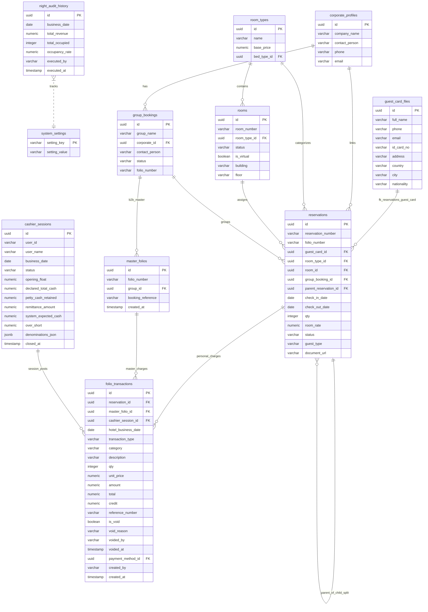
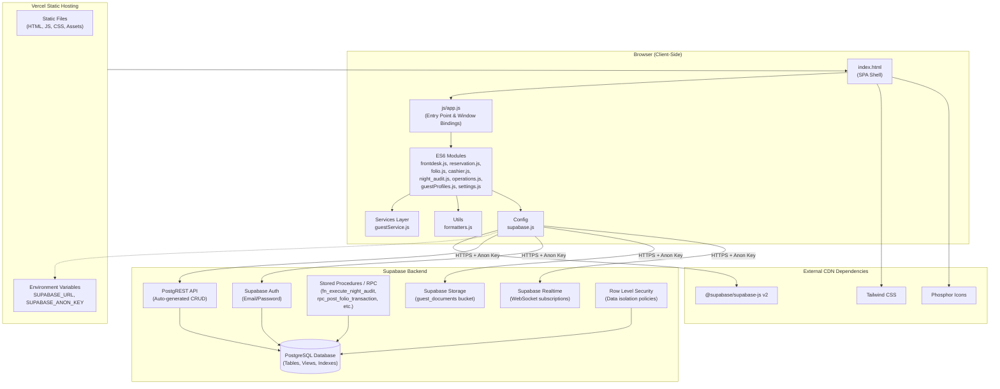
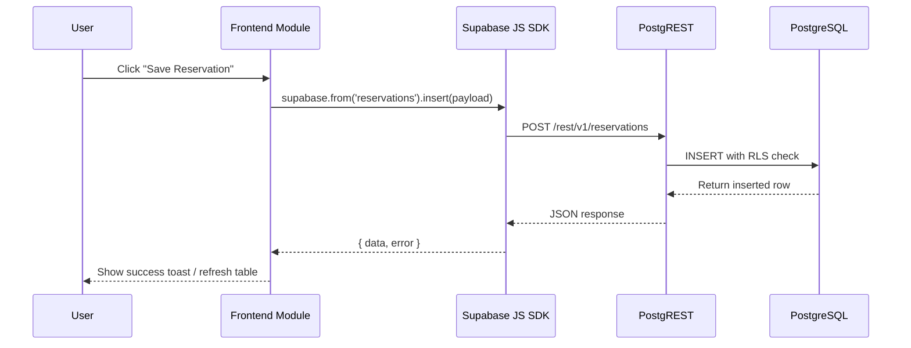
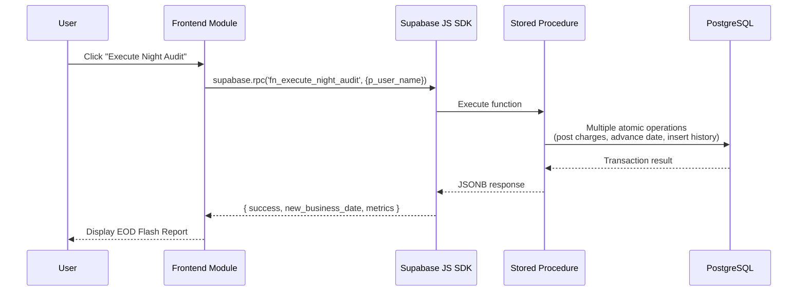
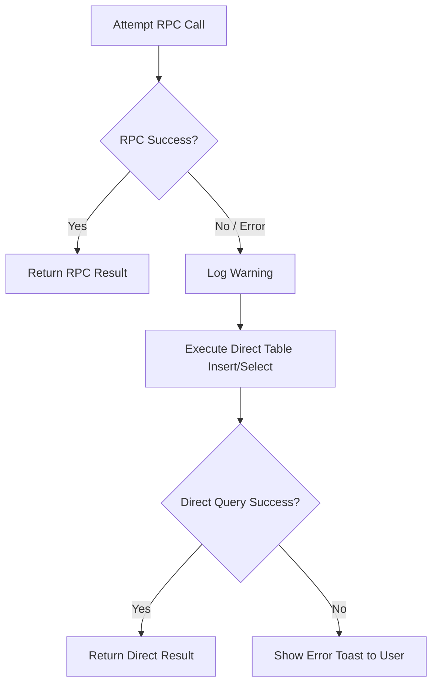
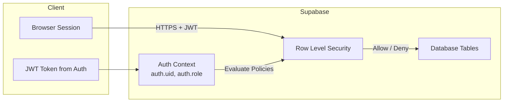

# Technical Specification & Database Schema - Supabase Hotel PMS

## Database Schema Overview & Entity Relationship Diagram

The backend of the Hotel Property Management System is hosted on Supabase (PostgreSQL). The architecture centers around guest lifecycle tracking (`reservations`, `guest_card_files`), folio financial ledgers (`folio_transactions`, `master_folios`), cashier shift auditing (`cashier_sessions`), daily settlement (`night_audit_history`), and property configuration master tables (`rooms`, `room_types`, `rate_plans`, etc.).

### Entity Relationship Diagram (ERD)



---

## System Architecture

### High-Level Architecture Diagram



### Architecture Components

#### 1. Frontend Layer (Browser-Side)
- **Technology**: Pure Vanilla JavaScript with ES6 Modules, no build step or bundler.
- **Entry Point**: `js/app.js` imports all feature modules and binds exported functions to `window` object for compatibility with inline HTML event handlers (`onclick`, `onchange`).
- **State Management**: Minimal global state via `window.currentHotelDate`, `window.currentUser`, and `localStorage` for session persistence.
- **UI Framework**: Tailwind CSS (utility-first) loaded via CDN; Phosphor Icons for iconography.
- **SPA Navigation**: View toggling via `switchView()` function that shows/hides section containers in `index.html`.

#### 2. Hosting Layer (Vercel)
- **Deployment Model**: Static site hosting with automatic HTTPS.
- **Build Process**: None (zero-build architecture). Files served as-is from repository root.
- **Environment Variables**: `SUPABASE_URL` and `SUPABASE_ANON_KEY` injected via Vercel dashboard (currently hardcoded in `js/config/supabase.js` for simplicity, relying on Supabase RLS for security).
- **CDN Caching**: Vercel Edge Network caches static assets globally.

#### 3. Backend Layer (Supabase)
- **Database**: PostgreSQL 15+ with automatic backups, point-in-time recovery.
- **API**: PostgREST auto-generates RESTful endpoints from database schema; supports filtering, pagination, and embedded relations via query parameters.
- **RPC Functions**: Custom PostgreSQL stored procedures for complex atomic operations (Night Audit, Folio Posting, Checkout, Cashier Shift).
- **Authentication**: Supabase Auth with email/password provider; JWT tokens stored in browser session.
- **Storage**: Dedicated bucket `guest_documents` for compressed guest ID card uploads (JPEG, max 800px width, 0.7 quality).
- **Realtime**: WebSocket subscriptions for live updates (optional, used sparingly to avoid connection overhead).
- **Security**: Row Level Security (RLS) policies enforce data isolation per user/role at database level.

### Data Flow Patterns

#### Pattern 1: Standard CRUD Operation



#### Pattern 2: RPC Atomic Operation



#### Pattern 3: Client-Side Fallback



### Security Architecture



#### Key Security Principles
- **Zero Trust at Database Level**: All data access filtered through RLS policies, regardless of client-side logic.
- **Anon Key is Public by Design**: Supabase anon key is safe to expose in browser; security enforced via RLS, not key secrecy.
- **Service Role Key Never in Client**: `SUPABASE_SERVICE_ROLE_KEY` (bypasses RLS) is only used in server-side contexts (Edge Functions, cron jobs), never in frontend code.
- **Audit Trail Enforcement**: Void operations use soft-delete pattern; financial transactions cannot be hard-deleted.

---

## Column Dictionary

### 1. `folio_transactions`
The primary financial ledger table recording all charges, payments, deposits, and bill transfers.

| Column Name | Data Type | Constraint | Description |
| :--- | :--- | :--- | :--- |
| `id` | UUID | Primary Key | Unique transaction record identifier (default: `gen_random_uuid()`). |
| `reservation_id` | UUID | Foreign Key | Foreign key to `reservations.id` (null if posted directly to Master Folio). |
| `master_folio_id` | UUID | Foreign Key | Foreign key to `master_folios.id` for B2B or multi-room group charges. |
| `cashier_session_id`| UUID | Foreign Key | Foreign key to `cashier_sessions.id` linking transaction to active cashier shift. |
| `hotel_business_date`| DATE | Not Null | Operational hotel business date (`current_hotel_date`) when transaction occurred. |
| `transaction_type` | VARCHAR | Not Null | High-level transaction category: `'CHARGE'`, `'PAYMENT'`, `'DEPOSIT'`, `'TRANSFER'`. |
| `category` | VARCHAR | Nullable | Specific accounting category: `'ROOM_CHARGE'`, `'CASH'`, `'CREDIT_CARD'`, `'BANK_TRANSFER'`, `'EXTRA_CHARGE'`. |
| `description` | TEXT | Not Null | Item line description or memo (e.g., "Room Charge 101 - Night 1"). |
| `qty` | INTEGER | Default 1 | Item quantity. |
| `unit_price` | NUMERIC | Nullable | Unit rate per item. |
| `amount` | NUMERIC | Not Null | Calculated line total (`qty * unit_price`). |
| `total` | NUMERIC | Nullable | Normalized total amount for billing consistency. |
| `credit` | NUMERIC | Nullable | Credit/Payment amount populated during payment posting. |
| `reference_number` | VARCHAR | Nullable | External transaction reference (e.g., EDC Auth Code, Transfer Ref). |
| `payment_method_id`| UUID | Foreign Key | Foreign key to `payment_methods.id`. |
| `is_void` | BOOLEAN | Default false| Audit flag indicating if transaction was voided (`true`/`false`). |
| `void_reason` | TEXT | Nullable | Mandatory explanation entered when voiding transaction. |
| `voided_by` | VARCHAR | Nullable | Username of cashier/admin who voided transaction. |
| `voided_at` | TIMESTAMP | Nullable | Timestamp when void was executed. |
| `created_by` | VARCHAR | Nullable | Username of cashier who created entry. |
| `created_at` | TIMESTAMP | Default NOW() | System record creation timestamp. |

### 2. `cashier_sessions`
Tracks cashier work shifts, opening floats, blind drop inputs, and cash variances.

| Column Name | Data Type | Constraint | Description |
| :--- | :--- | :--- | :--- |
| `id` | UUID | Primary Key | Unique shift identifier. |
| `user_id` | VARCHAR | Nullable | Supabase Auth user ID or cashier account identifier. |
| `user_name` | VARCHAR | Not Null | Display name of the cashier operating the shift. |
| `business_date` | DATE | Not Null | Operational hotel business date associated with shift. |
| `status` | VARCHAR | Not Null | Shift status: `'OPEN'` or `'CLOSED'`. |
| `opening_float` | NUMERIC | Default 0 | Initial cash drawer float declared at shift open. |
| `declared_total_cash`| NUMERIC | Nullable | Total cash counted by cashier during blind close drop. |
| `petty_cash_retained`| NUMERIC | Default 0 | Cash retained in drawer for next shift float. |
| `remittance_amount` | NUMERIC | Nullable | Cash dropped for bank deposit (`declared_total_cash - petty_cash_retained`). |
| `system_expected_cash`| NUMERIC| Nullable | System calculated expected cash (`opening_float + cash_payments - paid_outs`). |
| `over_short` | NUMERIC | Nullable | Cash variance (`declared_total_cash - system_expected_cash`). |
| `denominations_json`| JSONB | Nullable | JSON breakdown of coin and bank note counts during close drop. |
| `closed_at` | TIMESTAMP | Nullable | Timestamp when shift was closed. |

### 3. `reservations`
Stores individual and group guest stay records, rates, and stay lifecycle statuses.

| Column Name | Data Type | Constraint | Description |
| :--- | :--- | :--- | :--- |
| `id` | UUID | Primary Key | Unique reservation identifier. |
| `reservation_number`| VARCHAR | Unique | Formatted reservation code (e.g., `RES-20251005-001`). |
| `folio_number` | VARCHAR | Nullable | Formatted personal folio number (e.g., `FOL-1001`). |
| `guest_card_id` | UUID | Foreign Key | Foreign key to `guest_card_files.id` (relationship `guest_card_files!fk_reservations_guest_card`). |
| `guest_profile_id` | UUID | Foreign Key | Legacy guest profile reference (sanitized to `null` to prevent FK errors). |
| `guest_name` | VARCHAR | Not Null | Primary guest display name. |
| `booker_name` | VARCHAR | Nullable | Booker / contact person name. |
| `room_type_id` | UUID | Foreign Key | Foreign key to `room_types.id`. |
| `room_id` | UUID | Foreign Key | Foreign key to physical `rooms.id` (null if unassigned). |
| `group_booking_id` | UUID | Foreign Key | Foreign key to `group_bookings.id` for group line allocations. |
| `group_id` | UUID | Nullable | Group tracking identifier. |
| `parent_reservation_id`| UUID | Foreign Key | Self-referencing FK to parent reservation in multi-room split lines. |
| `check_in_date` | DATE | Not Null | Scheduled check-in date. |
| `check_out_date` | DATE | Not Null | Scheduled check-out date. |
| `qty` | INTEGER | Default 1 | Reserved room count (set to 1 after split). |
| `room_rate` | NUMERIC | Not Null | Daily room rate price. |
| `status` | VARCHAR | Not Null | Lifecycle status: `'GUARANTEED'`, `'6PM_HOLD'`, `'ORAL_CONFIRM'`, `'TENTATIVE'`, `'CHECKED_IN'`, `'CHECKED_OUT'`, `'CANCELLED'`. |
| `guest_type` | VARCHAR | Default 'FIT'| Guest category: `'FIT'`, `'Group'`, `'Non-Staying Guest'`. |
| `document_url` | TEXT | Nullable | Supabase storage URL for compressed guest ID card document. |

---

## RPC Functions Contract

All server-side business logic and atomic database operations are exposed via PostgreSQL stored procedures / Supabase RPC functions.

### 1. `fn_pre_night_audit_check()`
- **Input Parameters**: None.
- **Return Type**: `TABLE(can_proceed BOOLEAN, reason TEXT, open_shifts INTEGER, pending_arrivals INTEGER, pending_departures INTEGER)`.
- **Side Effects**: Reads `system_settings`, `cashier_sessions`, and `reservations`. Modifies no data.
- **Security Definition**: `SECURITY DEFINER` (Invokable by Night Auditor / Admin roles).
- **Client Fallback**: If RPC call fails, client performs client-side queries across `cashier_sessions` (`status = 'OPEN'`) and `reservations` (`js/modules/night_audit.js`).

### 2. `fn_execute_night_audit(p_user_name VARCHAR)`
- **Input Parameters**:
  - `p_user_name` (VARCHAR): Name of auditor initiating EOD process.
- **Return Type**: `JSONB` containing `{ success: true, new_business_date: 'YYYY-MM-DD', total_revenue: 12500000, total_occupied: 42 }`.
- **Side Effects**:
  1. Posts room charges to `folio_transactions` for in-house checked-in guests.
  2. Updates `system_settings.setting_value` for `current_hotel_date` (advances date by +1 day).
  3. Inserts summary entry into `night_audit_history`.
- **Security Definition**: `SECURITY DEFINER`.

### 3. `rpc_open_cashier_shift(p_cashier_name VARCHAR, p_shift_name VARCHAR, p_opening_float NUMERIC)`
- **Input Parameters**:
  - `p_cashier_name` (VARCHAR): Name of cashier.
  - `p_shift_name` (VARCHAR): Name of shift (e.g., Morning, Evening).
  - `p_opening_float` (NUMERIC): Initial cash drawer amount.
- **Return Type**: `JSONB` containing shift metadata and created `id`.
- **Side Effects**: Inserts new record into `cashier_sessions` with `status = 'OPEN'`.

### 4. `rpc_close_cashier_shift(p_shift_id UUID, p_actual_cash NUMERIC, p_cash_drop NUMERIC, p_notes TEXT)`
- **Input Parameters**:
  - `p_shift_id` (UUID): ID of shift to close.
  - `p_actual_cash` (NUMERIC): Declared cash total from blind drop count.
  - `p_cash_drop` (NUMERIC): Remittance cash dropped for bank deposit.
  - `p_notes` (TEXT): Cashier closing remarks.
- **Return Type**: `JSONB` with variance calculation (`over_short`).
- **Side Effects**: Updates `cashier_sessions` setting `status = 'CLOSED'`, `closed_at = NOW()`, `system_expected_cash`, and `over_short`.

### 5. `rpc_get_available_physical_rooms(p_room_type_id UUID, p_check_in DATE, p_check_out DATE, p_current_res_id UUID)`
- **Input Parameters**:
  - `p_room_type_id` (UUID, optional): Filter by specific room type.
  - `p_check_in` (DATE): Check-in date.
  - `p_check_out` (DATE): Check-out date.
  - `p_current_res_id` (UUID, optional): Reservation ID to exclude during edit mode.
- **Return Type**: `TABLE(id UUID, room_number VARCHAR, room_type_id UUID, room_type_name VARCHAR, status VARCHAR)`.
- **Side Effects**: None (Read-only query filtering physical rooms not occupied by overlapping active reservations or OOO blocks).
- **Client Fallback**: Implemented in `getAvailablePhysicalRoomsFallback()` in `js/modules/reservation.js`.

### 6. `rpc_post_folio_transaction(...)`
- **Input Parameters**:
  - `p_reservation_id` (UUID)
  - `p_master_folio_id` (UUID)
  - `p_transaction_type` (VARCHAR)
  - `p_description` (TEXT)
  - `p_category` (VARCHAR)
  - `p_qty` (INTEGER)
  - `p_unit_price` (NUMERIC)
  - `p_amount` (NUMERIC)
  - `p_reference_number` (VARCHAR)
- **Return Type**: `JSONB` with posted transaction record.
- **Side Effects**: Inserts record into `folio_transactions` setting `hotel_business_date` from system settings and binding active `cashier_session_id`.

### 7. `rpc_transfer_folio_transaction(p_transaction_ids UUID[], p_target_reservation_id UUID, p_target_master_folio_id UUID)`
- **Input Parameters**:
  - `p_transaction_ids` (UUID[]): Array of transaction IDs to transfer.
  - `p_target_reservation_id` (UUID): Target guest reservation ID.
  - `p_target_master_folio_id` (UUID): Target master folio ID.
- **Return Type**: `BOOLEAN`.
- **Side Effects**: Performs atomic transfer in `folio_transactions`, creating offsetting reversal entries on source folio and charge entries on target folio.

### 8. `rpc_void_folio_transaction(p_transaction_id UUID, p_void_reason TEXT)`
- **Input Parameters**:
  - `p_transaction_id` (UUID): Transaction ID to void.
  - `p_void_reason` (TEXT): Mandatory void explanation.
- **Return Type**: `BOOLEAN`.
- **Side Effects**: Updates `folio_transactions` setting `is_void = true`, `void_reason = p_void_reason`, `voided_by = currentUser`, and `voided_at = NOW()`.

### 9. `rpc_split_group_reservation(p_reservation_id UUID)`
- **Input Parameters**:
  - `p_reservation_id` (UUID): Parent group reservation ID with `qty > 1`.
- **Return Type**: `JSONB` containing generated child reservation IDs.
- **Side Effects**: Updates parent reservation `qty = 1` and creates $N - 1$ child `reservations` records with `qty = 1`, linking `group_booking_id` and setting `parent_reservation_id = null`.

### 10. `rpc_process_checkout(p_reservation_id UUID)`
- **Input Parameters**:
  - `p_reservation_id` (UUID): Reservation ID to check out.
- **Return Type**: `JSONB`.
- **Side Effects**: Validates zero balance, updates `reservations.status = 'CHECKED_OUT'`, and updates assigned `rooms.status = 'Dirty'`.

---

## API Reference (RPC Functions - OpenAPI-Style)

> **Note**: This section provides an OpenAPI-style reference for all Supabase RPC functions. For detailed business logic and side effects, refer to the "RPC Functions Contract" section above.

### Endpoint Pattern
All RPC functions are invoked via:
```http
POST https://{PROJECT_REF}.supabase.co/rest/v1/rpc/{function_name}
Headers:
Authorization: Bearer {JWT_TOKEN}
apikey: {SUPABASE_ANON_KEY}
Content-Type: application/json
Body: { "param1": value1, "param2": value2, ... }
```

### Function Catalog

#### 1. `fn_pre_night_audit_check`
```yaml
summary: Validate system readiness before executing Night Audit
parameters:
  - (none)
responses:
  200:
    description: Validation result
    content:
      application/json:
        schema:
          type: object
          properties:
            can_proceed: { type: boolean }
            reason: { type: string }
            open_shifts: { type: integer }
            pending_arrivals: { type: integer }
            pending_departures: { type: integer }
security: [bearerAuth: []]
```

#### 2. `fn_execute_night_audit`
```yaml
summary: Execute End-of-Day settlement and advance business date
parameters:
  - name: p_user_name
    in: body
    required: true
    schema: { type: string }
    description: Name of auditor initiating EOD
responses:
  200:
    description: EOD execution result
    content:
      application/json:
        schema:
          type: object
          properties:
            success: { type: boolean }
            new_business_date: { type: string, format: date }
            total_revenue: { type: number }
            total_occupied: { type: integer }
security: [bearerAuth: []]
```

#### 3. `rpc_open_cashier_shift`
```yaml
summary: Open a new cashier shift session
parameters:
  - name: p_cashier_name
    in: body
    required: true
    schema: { type: string }
  - name: p_shift_name
    in: body
    required: true
    schema: { type: string }
    example: "Morning"
  - name: p_opening_float
    in: body
    required: true
    schema: { type: number }
responses:
  200:
    description: Created shift metadata
    content:
      application/json:
        schema:
          type: object
          properties:
            id: { type: string, format: uuid }
            status: { type: string, enum: [OPEN] }
            business_date: { type: string, format: date }
security: [bearerAuth: []]
```

#### 4. `rpc_close_cashier_shift`
```yaml
summary: Close cashier shift with blind drop reconciliation
parameters:
  - name: p_shift_id
    in: body
    required: true
    schema: { type: string, format: uuid }
  - name: p_actual_cash
    in: body
    required: true
    schema: { type: number }
    description: Declared physical cash total
  - name: p_cash_drop
    in: body
    required: true
    schema: { type: number }
    description: Remittance amount for bank deposit
  - name: p_notes
    in: body
    required: false
    schema: { type: string }
responses:
  200:
    description: Closed shift with variance calculation
    content:
      application/json:
        schema:
          type: object
          properties:
            over_short: { type: number }
            system_expected_cash: { type: number }
            declared_total_cash: { type: number }
security: [bearerAuth: []]
```

#### 5. `rpc_get_available_physical_rooms`
```yaml
summary: Fetch available physical rooms for a date range
parameters:
  - name: p_room_type_id
    in: body
    required: false
    schema: { type: string, format: uuid }
  - name: p_check_in
    in: body
    required: true
    schema: { type: string, format: date }
  - name: p_check_out
    in: body
    required: true
    schema: { type: string, format: date }
  - name: p_current_res_id
    in: body
    required: false
    schema: { type: string, format: uuid }
    description: Exclude this reservation (for edit mode)
responses:
  200:
    description: List of available rooms
    content:
      application/json:
        schema:
          type: array
          items:
            type: object
            properties:
              id: { type: string, format: uuid }
              room_number: { type: string }
              room_type_id: { type: string, format: uuid }
              room_type_name: { type: string }
              status: { type: string }
security: [bearerAuth: []]
```

#### 6. `rpc_post_folio_transaction`
```yaml
summary: Post a charge or payment to a folio
parameters:
  - name: p_reservation_id
    in: body
    required: false
    schema: { type: string, format: uuid }
  - name: p_master_folio_id
    in: body
    required: false
    schema: { type: string, format: uuid }
  - name: p_transaction_type
    in: body
    required: true
    schema: { type: string, enum: [CHARGE, PAYMENT, DEPOSIT, TRANSFER] }
  - name: p_description
    in: body
    required: true
    schema: { type: string }
  - name: p_category
    in: body
    required: false
    schema: { type: string }
  - name: p_qty
    in: body
    required: false
    schema: { type: integer, default: 1 }
  - name: p_unit_price
    in: body
    required: false
    schema: { type: number }
  - name: p_amount
    in: body
    required: true
    schema: { type: number }
  - name: p_reference_number
    in: body
    required: false
    schema: { type: string }
responses:
  200:
    description: Posted transaction record
    content:
      application/json:
        schema:
          $ref: '#/components/schemas/FolioTransaction'
security: [bearerAuth: []]
```

#### 7. `rpc_transfer_folio_transaction`
```yaml
summary: Transfer selected transactions between folios
parameters:
  - name: p_transaction_ids
    in: body
    required: true
    schema:
      type: array
      items: { type: string, format: uuid }
  - name: p_target_reservation_id
    in: body
    required: false
    schema: { type: string, format: uuid }
  - name: p_target_master_folio_id
    in: body
    required: false
    schema: { type: string, format: uuid }
responses:
  200:
    description: Transfer success
    content:
      application/json:
        schema: { type: boolean }
security: [bearerAuth: []]
```

#### 8. `rpc_void_folio_transaction`
```yaml
summary: Void a transaction with audit trail
parameters:
  - name: p_transaction_id
    in: body
    required: true
    schema: { type: string, format: uuid }
  - name: p_void_reason
    in: body
    required: true
    schema: { type: string }
responses:
  200:
    description: Void success
    content:
      application/json:
        schema: { type: boolean }
security: [bearerAuth: []]
```

#### 9. `rpc_split_group_reservation`
```yaml
summary: Split a multi-qty group reservation into individual lines
parameters:
  - name: p_reservation_id
    in: body
    required: true
    schema: { type: string, format: uuid }
responses:
  200:
    description: Generated child reservation IDs
    content:
      application/json:
        schema:
          type: object
          properties:
            child_ids:
              type: array
              items: { type: string, format: uuid }
security: [bearerAuth: []]
```

#### 10. `rpc_process_checkout`
```yaml
summary: Check out a guest and settle folio
parameters:
  - name: p_reservation_id
    in: body
    required: true
    schema: { type: string, format: uuid }
responses:
  200:
    description: Checkout result
    content:
      application/json:
        schema:
          type: object
          properties:
            success: { type: boolean }
            final_balance: { type: number }
security: [bearerAuth: []]
```

### HTTP Response Codes Summary

| Code | Meaning | Action |
| :--- | :--- | :--- |
| 200 | Success | Process response data |
| 400 | Bad Request (validation error) | Check parameter types and required fields |
| 401 | Unauthorized | JWT expired or invalid; prompt re-login |
| 403 | Forbidden (RLS policy denied) | User lacks permission for this operation |
| 404 | Resource not found | Check if referenced ID exists |
| 500 | Server error (RPC failure) | Check Supabase logs; client fallback may trigger |

---

## Database Indexes & Query Optimization

### Overview
Database indexes are critical for maintaining query performance as transaction volume grows. The following indexes have been created on the Supabase PostgreSQL instance to support the most frequent and performance-sensitive queries in the application.

### Index Catalog

| Index Name | Table | Columns | Type | Purpose |
|---|---|---|---|---|
| idx_folio_tx_hotel_bdate | folio_transactions | hotel_business_date | B-Tree | Accelerates daily revenue aggregation and EOD Flash Report queries filtered by business date. |
| idx_folio_tx_session_created | folio_transactions | cashier_session_id, created_at DESC | B-Tree Composite | Speeds up per-shift transaction fetching during cashier close and shift report generation. |
| idx_cashier_sessions_status_bdate | cashier_sessions | business_date, status | B-Tree Composite | Enables instant lookup for pre-audit checks (e.g., "Are there any OPEN shifts today?"). |
| idx_reservations_dates_status | reservations | check_in_date, check_out_date, status | B-Tree Composite | Optimizes Tape Chart and Room Forecast queries that filter reservations by date range and active status. |
| idx_reservations_room_dates | reservations | room_id, check_in_date, check_out_date | B-Tree Composite | Accelerates physical room conflict detection (checkRoomConflict) during reservation save and check-in. |
| idx_folio_tx_reservation | folio_transactions | reservation_id | B-Tree | Speeds up folio balance calculations for individual guest accounts. |
| idx_folio_tx_master | folio_transactions | master_folio_id | B-Tree | Optimizes Master Folio aggregation for B2B corporate billing. |
| idx_guest_card_name | guest_card_files | full_name | B-Tree (GIN trigram recommended) | Accelerates GCF quick lookup and autocomplete search by guest name. |

### Performance Notes
- Without idx_folio_tx_hotel_bdate, the Night Audit EOD report would perform a full table scan on folio_transactions, which becomes prohibitively slow beyond ~50,000 records.
- The composite index on cashier_sessions (business_date, status) ensures the pre-audit blocking check completes in O(log n) time regardless of total session history.
- For guest name search at scale (>10,000 GCF records), consider upgrading idx_guest_card_name to a GIN trigram index: CREATE INDEX idx_guest_card_name_trgm ON guest_card_files USING gin (full_name gin_trgm_ops);

### Maintenance
- Indexes should be reviewed quarterly as data volume grows.
- Run ANALYZE on heavily modified tables (folio_transactions, reservations) weekly to keep PostgreSQL query planner statistics current: ANALYZE folio_transactions; ANALYZE reservations;

---

## API Integration Patterns

The application communicates directly with Supabase via `@supabase/supabase-js` instantiated in `js/config/supabase.js`.

### 1. Explicit Foreign Key Relationships
To avoid PostgREST schema cache relationship ambiguity errors (PGRST201), explicit foreign key relationship syntax is mandatory when embedding related tables:
```javascript
// Correct explicit relationship syntax for guest card lookup
const { data, error } = await supabaseClient
    .from('reservations')
    .select(`
        *,
        guest_card_files!fk_reservations_guest_card (
            full_name, phone, email, id_card_no, address, country, city
        ),
        room_types ( name ),
        rooms ( room_number )
    `)
    .eq('id', reservationId);
```

### 2. Inner Join Cashier Reconciliations
Cashier reports isolate transactions for specific business dates or cashier sessions using inner joins on `cashier_sessions`:
```javascript
const { data, error } = await supabaseClient
    .from('folio_transactions')
    .select(`
        *,
        cashier_sessions!inner ( status, user_name, business_date )
    `)
    .eq('hotel_business_date', businessDate)
    .eq('is_void', false);
```

### 3. Client-Side Fallback Pattern
For resilience against network glitches or missing DB functions, module calls wrap RPC invocations with robust JavaScript client-side fallbacks:
```javascript
try {
    const { data, error } = await supabaseClient.rpc('rpc_post_folio_transaction', payload);
    if (error) throw error;
    return data;
} catch (err) {
    console.warn('RPC unavailable, executing direct table insert fallback:', err);
    const { data, error } = await supabaseClient
        .from('folio_transactions')
        .insert([directPayload])
        .select();
    return data;
}
```

---

## Deployment & Environment

- **Architecture**: Pure ES6 Module Frontend Client (No Node.js build step, no Webpack/Vite bundlers).
- **CDN Dependency Loading**: All external libraries are loaded in `index.html` via public CDNs:
  - Tailwind CSS: `https://cdn.tailwindcss.com`
  - Phosphor Icons: `https://unpkg.com/@phosphor-icons/web`
  - Supabase JS SDK: `https://cdn.jsdelivr.net/npm/@supabase/supabase-js@2`
- **Hosting & Vercel Configuration**:
  - Hosted directly on Vercel as a static site.
  - Root directory serves `index.html`.
  - Modules loaded natively via `<script type="module" src="./js/app.js"></script>`.
- **Local Development Constraints**:
  - Can be served using any static HTTP file server (e.g., `python3 -m http.server 8000` or Live Server).
  - Environment variables for Supabase URL and Publishable Key are declared in `js/config/supabase.js`.

---

## Environment Configuration & Secrets Management

### Required Environment Variables

The application requires the following environment variables to connect to the Supabase backend:

| Variable Name | Description | Example Value | Required |
|---|---|---|---|
| SUPABASE_URL | The unique API URL for your Supabase project. Found in Supabase Dashboard > Settings > API. | https://abcdefgh.supabase.co | Yes |
| SUPABASE_ANON_KEY | The public anonymous access key for client-side Supabase JS SDK. Safe to expose in browser. | eyJhbGciOiJIUzI1NiIs... | Yes |

Note: The application does NOT use SUPABASE_SERVICE_ROLE_KEY on the client side. The service role key should only be used in server-side contexts (Edge Functions, cron jobs) and must never be exposed in frontend code.

### Vercel Configuration

1. Navigate to Vercel Dashboard > Your Project > Settings > Environment Variables.
2. Add SUPABASE_URL and SUPABASE_ANON_KEY as Production environment variables.
3. If using Preview deployments, add the same variables to Preview environment.
4. Redeploy the project after adding variables for changes to take effect.

Current Implementation Note:
In the current codebase, Supabase credentials are declared directly in js/config/supabase.js. For production security, these should be migrated to Vercel environment variables and injected at build time or via a serverless API proxy. However, since this is a pure static SPA with no build step, the current approach relies on:
- Supabase Row Level Security (RLS) to protect data at the database level.
- The anon key being intentionally public (designed for client-side use).
- RLS policies ensuring users can only access data they are authorized to see.

### Local Development Setup

Since the application uses pure ES6 modules with CDN dependencies and no npm/build step:

1. Clone the repository.
2. Open js/config/supabase.js and ensure SUPABASE_URL and SUPABASE_ANON_KEY point to your Supabase project.
3. Serve the project using any static HTTP server:
   - Python: python3 -m http.server 8000
   - Node.js (npx): npx serve .
   - VS Code: Live Server extension
4. Open http://localhost:8000 in your browser.

Important: Do NOT open index.html directly via file:// protocol. ES6 modules require HTTP(S) context to resolve imports correctly.

### Security Checklist

- [ ] Supabase RLS is enabled on all tables containing guest data and financial transactions.
- [ ] SUPABASE_SERVICE_ROLE_KEY is NOT present in any frontend JavaScript file.
- [ ] Supabase Auth is configured with email/password provider and appropriate redirect URLs.
- [ ] Vercel deployment uses HTTPS (automatic on Vercel).
- [ ] No API keys, passwords, or tokens are committed to the git repository.
- [ ] .gitignore includes patterns for .env, .env.local, and any local config files.
- [ ] Supabase Storage bucket guest_documents has RLS policies restricting access to authenticated users only.

---

## Troubleshooting Guide

### Common Issues & Solutions

#### 1. Night Audit Blocked: "Open Cashier Shifts Exist"
- **Symptom**: Pre-audit check fails with warning listing active cashiers.
- **Cause**: One or more cashier sessions remain in `status = 'OPEN'` for the current business date.
- **Solution**:
  1. Identify open shifts via query:
     ```sql
     SELECT id, user_name, business_date FROM cashier_sessions
     WHERE status = 'OPEN' AND business_date = CURRENT_DATE;
     ```
  2. Contact the listed cashiers to close their shifts via UI.
  3. If cashier is unavailable, Admin can manually close via SQL (with audit log entry):
     ```sql
     UPDATE cashier_sessions
     SET status = 'CLOSED', closed_at = NOW(),
         declared_total_cash = system_expected_cash,
         over_short = 0,
         denominations_json = '{"admin_override": true}'::jsonb
     WHERE id = '{shift_id}';
     ```
  4. Re-run Night Audit.

#### 2. Room Conflict Error During Check-In
- **Symptom**: "Room already occupied for selected dates" error when checking in guest.
- **Cause**: Overlapping reservation exists for the same physical room and date range.
- **Solution**:
  1. Check conflicting reservations:
     ```sql
     SELECT r.id, r.guest_name, r.check_in_date, r.check_out_date, r.status
     FROM reservations r
     WHERE r.room_id = '{room_id}'
       AND r.status IN ('GUARANTEED', '6PM_HOLD', 'ORAL_CONFIRM', 'CHECKED_IN')
       AND r.check_in_date < '{new_checkout}'
       AND r.check_out_date > '{new_checkin}';
     ```
  2. Resolve by either:
     - Canceling/modifying the conflicting reservation.
     - Assigning a different room to the new check-in.
  3. Retry check-in.

#### 3. Foreign Key Violation on Reservation Save
- **Symptom**: Error `new row violates foreign key constraint "fk_reservations_guest_card"`.
- **Cause**: Empty string `""`, `0`, or `undefined` passed for `guest_card_id` instead of `null`.
- **Solution**:
  1. Ensure frontend sanitizes empty values to `null` before insert:
     ```javascript
     guest_card_id: guestCardId || null,  // NOT guestCardId || ''
     guest_profile_id: guestProfileId || null
     ```
  2. If data already corrupted, fix via SQL:
     ```sql
     UPDATE reservations
     SET guest_card_id = NULL
     WHERE guest_card_id = '00000000-0000-0000-0000-000000000000';
     ```

#### 4. Night Audit EOD Report Shows Zero Reconciliation Data
- **Symptom**: Cashier Reconciliation Summary in EOD Flash Report shows all zeros.
- **Cause**: Query filter mismatch — `folio_transactions.hotel_business_date` not populated or mismatched with `cashier_sessions.business_date`.
- **Solution**:
  1. Verify data exists:
     ```sql
     SELECT COUNT(*) FROM folio_transactions
     WHERE hotel_business_date = '{target_date}';
     ```
  2. If count is 0, backfill missing data:
     ```sql
     UPDATE folio_transactions
     SET hotel_business_date = transaction_date::DATE
     WHERE hotel_business_date IS NULL;
     ```
  3. Re-run Night Audit.

#### 5. Tape Chart Not Rendering Reservation Capsules
- **Symptom**: Tape Chart grid loads but reservation capsules are invisible.
- **Cause**: CSS positioning issue or missing `room_id` on reservations.
- **Solution**:
  1. Check browser console for JavaScript errors.
  2. Verify reservations have `room_id` assigned:
     ```sql
     SELECT id, guest_name, room_id FROM reservations
     WHERE check_in_date <= CURRENT_DATE
       AND check_out_date > CURRENT_DATE
       AND status IN ('GUARANTEED', 'CHECKED_IN')
       AND room_id IS NULL;
     ```
  3. Assign rooms via Frontdesk UI or SQL.
  4. Refresh page.

#### 6. Cashier Shift Over/Short Always Shows Large Variance
- **Symptom**: Every shift close shows significant negative over/short.
- **Cause**: Transactions posted without `cashier_session_id`, so they're excluded from `system_expected_cash` calculation but physically present in drawer.
- **Solution**:
  1. Check orphan transactions:
     ```sql
     SELECT COUNT(*) FROM folio_transactions
     WHERE cashier_session_id IS NULL
       AND hotel_business_date = CURRENT_DATE;
     ```
  2. If count > 0, link them to active session:
     ```sql
     UPDATE folio_transactions
     SET cashier_session_id = '{active_session_id}'
     WHERE cashier_session_id IS NULL
       AND hotel_business_date = CURRENT_DATE;
     ```
  3. Update `rpc_post_folio_transaction` to always bind `cashier_session_id` from `window.currentCashierSessionId`.

#### 7. Supabase Query Performance Degradation
- **Symptom**: Dashboard or reports take >10 seconds to load.
- **Cause**: Missing indexes on frequently queried columns.
- **Solution**:
  1. Check slow queries via Supabase Dashboard > Database > Query Performance.
  2. Verify indexes exist:
     ```sql
     SELECT indexname, indexdef FROM pg_indexes
     WHERE tablename IN ('folio_transactions', 'reservations', 'cashier_sessions');
     ```
  3. Create missing indexes (refer to "Database Indexes & Query Optimization" section).
  4. Run `ANALYZE` on affected tables to update query planner statistics.

#### 8. Guest Document Upload Fails
- **Symptom**: ID card image upload returns 400 or 413 error.
- **Cause**: File exceeds Supabase Storage size limit (default 50MB) or bucket RLS policy denies access.
- **Solution**:
  1. Ensure client-side compression is active (JPEG 0.7 quality, max 800px width).
  2. Check bucket RLS policy:
     ```sql
     SELECT * FROM pg_policies WHERE tablename = 'objects' AND schemaname = 'storage';
     ```
  3. Verify bucket `guest_documents` exists and allows authenticated uploads.

#### 9. Business Date Desynchronization
- **Symptom**: UI shows different dates across modules after midnight.
- **Cause**: Day Change Detector polling missed or `window.currentHotelDate` not refreshed.
- **Solution**:
  1. Manually trigger reload: `window.location.reload()`.
  2. Verify `system_settings.current_hotel_date` is correct:
     ```sql
     SELECT setting_value FROM system_settings WHERE setting_key = 'current_hotel_date';
     ```
  3. If Night Audit failed to advance date, re-run Night Audit or manually update (Admin only).

#### 10. Void Transaction Still Affects Revenue Totals
- **Symptom**: Voided transactions appear in daily revenue reports.
- **Cause**: Report query does not filter `is_void = false`.
- **Solution**:
  1. Update report query to exclude voids:
     ```javascript
     .eq('is_void', false)
     ```
  2. For audit trail display (Section 4 of Cashier Report), query voids separately:
     ```javascript
     .eq('is_void', true)
     ```

### Escalation Path

If issues persist after following solutions above:
1. Check Supabase Dashboard > Logs for detailed error messages.
2. Review browser console for client-side errors.
3. Verify RLS policies via `pg_policies` table.
4. Contact Supabase Support if database-level issues suspected.

For application bugs, create GitHub Issue with:
- Steps to reproduce
- Expected vs actual behavior
- Browser console logs
- Supabase query logs (if accessible)
