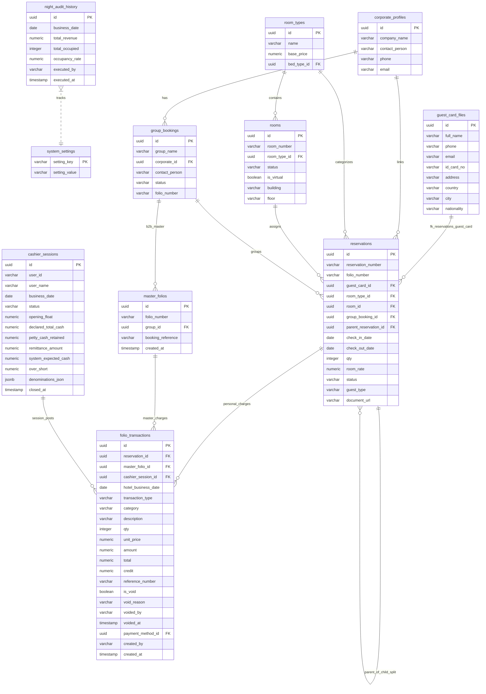

# Technical Specification & Database Schema - Supabase Hotel PMS

## Database Schema Overview & Entity Relationship Diagram

The backend of the Hotel Property Management System is hosted on Supabase (PostgreSQL). The architecture centers around guest lifecycle tracking (`reservations`, `guest_card_files`), folio financial ledgers (`folio_transactions`, `master_folios`), cashier shift auditing (`cashier_sessions`), daily settlement (`night_audit_history`), and property configuration master tables (`rooms`, `room_types`, `rate_plans`, etc.).

### Entity Relationship Diagram (ERD)



---

## Column Dictionary

### 1. `folio_transactions`
The primary financial ledger table recording all charges, payments, deposits, and bill transfers.

| Column Name | Data Type | Constraint | Description |
| :--- | :--- | :--- | :--- |
| `id` | UUID | Primary Key | Unique transaction record identifier (default: `gen_random_uuid()`). |
| `reservation_id` | UUID | Foreign Key | Foreign key to `reservations.id` (null if posted directly to Master Folio). |
| `master_folio_id` | UUID | Foreign Key | Foreign key to `master_folios.id` for B2B or multi-room group charges. |
| `cashier_session_id`| UUID | Foreign Key | Foreign key to `cashier_sessions.id` linking transaction to active cashier shift. |
| `hotel_business_date`| DATE | Not Null | Operational hotel business date (`current_hotel_date`) when transaction occurred. |
| `transaction_type` | VARCHAR | Not Null | High-level transaction category: `'CHARGE'`, `'PAYMENT'`, `'DEPOSIT'`, `'TRANSFER'`. |
| `category` | VARCHAR | Nullable | Specific accounting category: `'ROOM_CHARGE'`, `'CASH'`, `'CREDIT_CARD'`, `'BANK_TRANSFER'`, `'EXTRA_CHARGE'`. |
| `description` | TEXT | Not Null | Item line description or memo (e.g., "Room Charge 101 - Night 1"). |
| `qty` | INTEGER | Default 1 | Item quantity. |
| `unit_price` | NUMERIC | Nullable | Unit rate per item. |
| `amount` | NUMERIC | Not Null | Calculated line total (`qty * unit_price`). |
| `total` | NUMERIC | Nullable | Normalized total amount for billing consistency. |
| `credit` | NUMERIC | Nullable | Credit/Payment amount populated during payment posting. |
| `reference_number` | VARCHAR | Nullable | External transaction reference (e.g., EDC Auth Code, Transfer Ref). |
| `payment_method_id`| UUID | Foreign Key | Foreign key to `payment_methods.id`. |
| `is_void` | BOOLEAN | Default false| Audit flag indicating if transaction was voided (`true`/`false`). |
| `void_reason` | TEXT | Nullable | Mandatory explanation entered when voiding transaction. |
| `voided_by` | VARCHAR | Nullable | Username of cashier/admin who voided transaction. |
| `voided_at` | TIMESTAMP | Nullable | Timestamp when void was executed. |
| `created_by` | VARCHAR | Nullable | Username of cashier who created entry. |
| `created_at` | TIMESTAMP | Default NOW() | System record creation timestamp. |

### 2. `cashier_sessions`
Tracks cashier work shifts, opening floats, blind drop inputs, and cash variances.

| Column Name | Data Type | Constraint | Description |
| :--- | :--- | :--- | :--- |
| `id` | UUID | Primary Key | Unique shift identifier. |
| `user_id` | VARCHAR | Nullable | Supabase Auth user ID or cashier account identifier. |
| `user_name` | VARCHAR | Not Null | Display name of the cashier operating the shift. |
| `business_date` | DATE | Not Null | Operational hotel business date associated with shift. |
| `status` | VARCHAR | Not Null | Shift status: `'OPEN'` or `'CLOSED'`. |
| `opening_float` | NUMERIC | Default 0 | Initial cash drawer float declared at shift open. |
| `declared_total_cash`| NUMERIC | Nullable | Total cash counted by cashier during blind close drop. |
| `petty_cash_retained`| NUMERIC | Default 0 | Cash retained in drawer for next shift float. |
| `remittance_amount` | NUMERIC | Nullable | Cash dropped for bank deposit (`declared_total_cash - petty_cash_retained`). |
| `system_expected_cash`| NUMERIC| Nullable | System calculated expected cash (`opening_float + cash_payments - paid_outs`). |
| `over_short` | NUMERIC | Nullable | Cash variance (`declared_total_cash - system_expected_cash`). |
| `denominations_json`| JSONB | Nullable | JSON breakdown of coin and bank note counts during close drop. |
| `closed_at` | TIMESTAMP | Nullable | Timestamp when shift was closed. |

### 3. `reservations`
Stores individual and group guest stay records, rates, and stay lifecycle statuses.

| Column Name | Data Type | Constraint | Description |
| :--- | :--- | :--- | :--- |
| `id` | UUID | Primary Key | Unique reservation identifier. |
| `reservation_number`| VARCHAR | Unique | Formatted reservation code (e.g., `RES-20251005-001`). |
| `folio_number` | VARCHAR | Nullable | Formatted personal folio number (e.g., `FOL-1001`). |
| `guest_card_id` | UUID | Foreign Key | Foreign key to `guest_card_files.id` (relationship `guest_card_files!fk_reservations_guest_card`). |
| `guest_profile_id` | UUID | Foreign Key | Legacy guest profile reference (sanitized to `null` to prevent FK errors). |
| `guest_name` | VARCHAR | Not Null | Primary guest display name. |
| `booker_name` | VARCHAR | Nullable | Booker / contact person name. |
| `room_type_id` | UUID | Foreign Key | Foreign key to `room_types.id`. |
| `room_id` | UUID | Foreign Key | Foreign key to physical `rooms.id` (null if unassigned). |
| `group_booking_id` | UUID | Foreign Key | Foreign key to `group_bookings.id` for group line allocations. |
| `group_id` | UUID | Nullable | Group tracking identifier. |
| `parent_reservation_id`| UUID | Foreign Key | Self-referencing FK to parent reservation in multi-room split lines. |
| `check_in_date` | DATE | Not Null | Scheduled check-in date. |
| `check_out_date` | DATE | Not Null | Scheduled check-out date. |
| `qty` | INTEGER | Default 1 | Reserved room count (set to 1 after split). |
| `room_rate` | NUMERIC | Not Null | Daily room rate price. |
| `status` | VARCHAR | Not Null | Lifecycle status: `'GUARANTEED'`, `'6PM_HOLD'`, `'ORAL_CONFIRM'`, `'TENTATIVE'`, `'CHECKED_IN'`, `'CHECKED_OUT'`, `'CANCELLED'`. |
| `guest_type` | VARCHAR | Default 'FIT'| Guest category: `'FIT'`, `'Group'`, `'Non-Staying Guest'`. |
| `document_url` | TEXT | Nullable | Supabase storage URL for compressed guest ID card document. |

---

## RPC Functions Contract

All server-side business logic and atomic database operations are exposed via PostgreSQL stored procedures / Supabase RPC functions.

### 1. `fn_pre_night_audit_check()`
- **Input Parameters**: None.
- **Return Type**: `TABLE(can_proceed BOOLEAN, reason TEXT, open_shifts INTEGER, pending_arrivals INTEGER, pending_departures INTEGER)`.
- **Side Effects**: Reads `system_settings`, `cashier_sessions`, and `reservations`. Modifies no data.
- **Security Definition**: `SECURITY DEFINER` (Invokable by Night Auditor / Admin roles).
- **Client Fallback**: If RPC call fails, client performs client-side queries across `cashier_sessions` (`status = 'OPEN'`) and `reservations` (`js/modules/night_audit.js`).

### 2. `fn_execute_night_audit(p_user_name VARCHAR)`
- **Input Parameters**:
  - `p_user_name` (VARCHAR): Name of auditor initiating EOD process.
- **Return Type**: `JSONB` containing `{ success: true, new_business_date: 'YYYY-MM-DD', total_revenue: 12500000, total_occupied: 42 }`.
- **Side Effects**:
  1. Posts room charges to `folio_transactions` for in-house checked-in guests.
  2. Updates `system_settings.setting_value` for `current_hotel_date` (advances date by +1 day).
  3. Inserts summary entry into `night_audit_history`.
- **Security Definition**: `SECURITY DEFINER`.

### 3. `rpc_open_cashier_shift(p_cashier_name VARCHAR, p_shift_name VARCHAR, p_opening_float NUMERIC)`
- **Input Parameters**:
  - `p_cashier_name` (VARCHAR): Name of cashier.
  - `p_shift_name` (VARCHAR): Name of shift (e.g., Morning, Evening).
  - `p_opening_float` (NUMERIC): Initial cash drawer amount.
- **Return Type**: `JSONB` containing shift metadata and created `id`.
- **Side Effects**: Inserts new record into `cashier_sessions` with `status = 'OPEN'`.

### 4. `rpc_close_cashier_shift(p_shift_id UUID, p_actual_cash NUMERIC, p_cash_drop NUMERIC, p_notes TEXT)`
- **Input Parameters**:
  - `p_shift_id` (UUID): ID of shift to close.
  - `p_actual_cash` (NUMERIC): Declared cash total from blind drop count.
  - `p_cash_drop` (NUMERIC): Remittance cash dropped for bank deposit.
  - `p_notes` (TEXT): Cashier closing remarks.
- **Return Type**: `JSONB` with variance calculation (`over_short`).
- **Side Effects**: Updates `cashier_sessions` setting `status = 'CLOSED'`, `closed_at = NOW()`, `system_expected_cash`, and `over_short`.

### 5. `rpc_get_available_physical_rooms(p_room_type_id UUID, p_check_in DATE, p_check_out DATE, p_current_res_id UUID)`
- **Input Parameters**:
  - `p_room_type_id` (UUID, optional): Filter by specific room type.
  - `p_check_in` (DATE): Check-in date.
  - `p_check_out` (DATE): Check-out date.
  - `p_current_res_id` (UUID, optional): Reservation ID to exclude during edit mode.
- **Return Type**: `TABLE(id UUID, room_number VARCHAR, room_type_id UUID, room_type_name VARCHAR, status VARCHAR)`.
- **Side Effects**: None (Read-only query filtering physical rooms not occupied by overlapping active reservations or OOO blocks).
- **Client Fallback**: Implemented in `getAvailablePhysicalRoomsFallback()` in `js/modules/reservation.js`.

### 6. `rpc_post_folio_transaction(...)`
- **Input Parameters**:
  - `p_reservation_id` (UUID)
  - `p_master_folio_id` (UUID)
  - `p_transaction_type` (VARCHAR)
  - `p_description` (TEXT)
  - `p_category` (VARCHAR)
  - `p_qty` (INTEGER)
  - `p_unit_price` (NUMERIC)
  - `p_amount` (NUMERIC)
  - `p_reference_number` (VARCHAR)
- **Return Type**: `JSONB` with posted transaction record.
- **Side Effects**: Inserts record into `folio_transactions` setting `hotel_business_date` from system settings and binding active `cashier_session_id`.

### 7. `rpc_transfer_folio_transaction(p_transaction_ids UUID[], p_target_reservation_id UUID, p_target_master_folio_id UUID)`
- **Input Parameters**:
  - `p_transaction_ids` (UUID[]): Array of transaction IDs to transfer.
  - `p_target_reservation_id` (UUID): Target guest reservation ID.
  - `p_target_master_folio_id` (UUID): Target master folio ID.
- **Return Type**: `BOOLEAN`.
- **Side Effects**: Performs atomic transfer in `folio_transactions`, creating offsetting reversal entries on source folio and charge entries on target folio.

### 8. `rpc_void_folio_transaction(p_transaction_id UUID, p_void_reason TEXT)`
- **Input Parameters**:
  - `p_transaction_id` (UUID): Transaction ID to void.
  - `p_void_reason` (TEXT): Mandatory void explanation.
- **Return Type**: `BOOLEAN`.
- **Side Effects**: Updates `folio_transactions` setting `is_void = true`, `void_reason = p_void_reason`, `voided_by = currentUser`, and `voided_at = NOW()`.

### 9. `rpc_split_group_reservation(p_reservation_id UUID)`
- **Input Parameters**:
  - `p_reservation_id` (UUID): Parent group reservation ID with `qty > 1`.
- **Return Type**: `JSONB` containing generated child reservation IDs.
- **Side Effects**: Updates parent reservation `qty = 1` and creates $N - 1$ child `reservations` records with `qty = 1`, linking `group_booking_id` and setting `parent_reservation_id = null`.

### 10. `rpc_process_checkout(p_reservation_id UUID)`
- **Input Parameters**:
  - `p_reservation_id` (UUID): Reservation ID to check out.
- **Return Type**: `JSONB`.
- **Side Effects**: Validates zero balance, updates `reservations.status = 'CHECKED_OUT'`, and updates assigned `rooms.status = 'Dirty'`.

---

## API Integration Patterns

The application communicates directly with Supabase via `@supabase/supabase-js` instantiated in `js/config/supabase.js`.

### 1. Explicit Foreign Key Relationships
To avoid PostgREST schema cache relationship ambiguity errors (PGRST201), explicit foreign key relationship syntax is mandatory when embedding related tables:
```javascript
// Correct explicit relationship syntax for guest card lookup
const { data, error } = await supabaseClient
    .from('reservations')
    .select(`
        *,
        guest_card_files!fk_reservations_guest_card (
            full_name, phone, email, id_card_no, address, country, city
        ),
        room_types ( name ),
        rooms ( room_number )
    `)
    .eq('id', reservationId);
```

### 2. Inner Join Cashier Reconciliations
Cashier reports isolate transactions for specific business dates or cashier sessions using inner joins on `cashier_sessions`:
```javascript
const { data, error } = await supabaseClient
    .from('folio_transactions')
    .select(`
        *,
        cashier_sessions!inner ( status, user_name, business_date )
    `)
    .eq('hotel_business_date', businessDate)
    .eq('is_void', false);
```

### 3. Client-Side Fallback Pattern
For resilience against network glitches or missing DB functions, module calls wrap RPC invocations with robust JavaScript client-side fallbacks:
```javascript
try {
    const { data, error } = await supabaseClient.rpc('rpc_post_folio_transaction', payload);
    if (error) throw error;
    return data;
} catch (err) {
    console.warn('RPC unavailable, executing direct table insert fallback:', err);
    const { data, error } = await supabaseClient
        .from('folio_transactions')
        .insert([directPayload])
        .select();
    return data;
}
```

---

## Deployment & Environment

- **Architecture**: Pure ES6 Module Frontend Client (No Node.js build step, no Webpack/Vite bundlers).
- **CDN Dependency Loading**: All external libraries are loaded in `index.html` via public CDNs:
  - Tailwind CSS: `https://cdn.tailwindcss.com`
  - Phosphor Icons: `https://unpkg.com/@phosphor-icons/web`
  - Supabase JS SDK: `https://cdn.jsdelivr.net/npm/@supabase/supabase-js@2`
- **Hosting & Vercel Configuration**:
  - Hosted directly on Vercel as a static site.
  - Root directory serves `index.html`.
  - Modules loaded natively via `<script type="module" src="./js/app.js"></script>`.
- **Local Development Constraints**:
  - Can be served using any static HTTP file server (e.g., `python3 -m http.server 8000` or Live Server).
  - Environment variables for Supabase URL and Publishable Key are declared in `js/config/supabase.js`.
